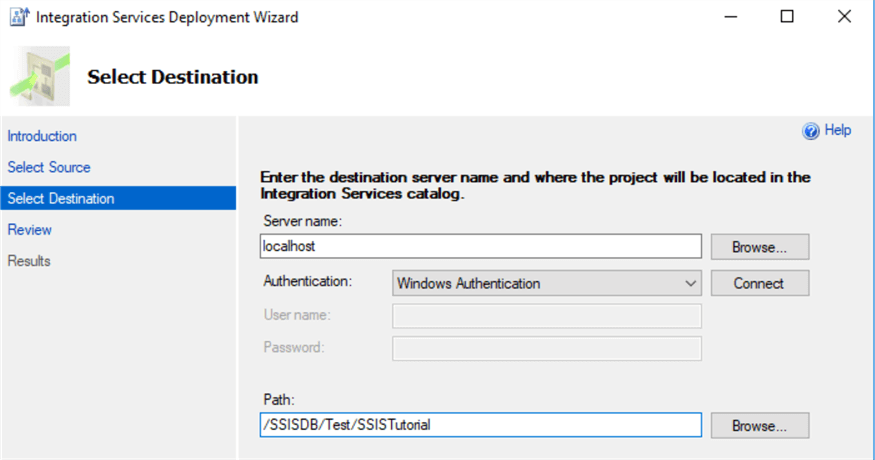

===================
Deploy SSIS Scripts
===================

It is recommended to install the SSIS packages into the SSIDB catalog. See `SSIS Tutorial <https://www.mssqltips.com/sqlservertutorial/9069/deploy-and-schedule-an-sql-server-integration-services-ssis-package-step-by-step/>`_ for a detailed guide on how to create a folder within SSIDB to enable you install the packages.
 

In Visual Studio, open the SSIS project and form the project menu and select Deploy.

This will start the SSIS deployment wizard. Keep in mind this will deploy the entire project, with all packages included. If you want to deploy an individual package, you can right-click on the package itself and choose Deploy.

In the first step of the wizard, we need to choose the destination. Enter the server name and make sure the SSIS catalog has already been created on that server. Enter the server login credentials if you are not using Windows authentication. If you want, you can also create a folder to store the project in.

At the next step, you get an overview of the actions the wizard will take. Hit Deploy to start the deployment. 

The deployment will go through a couple of steps: 

The project has now been deployed to the server and you can find it in the catalog: 

.. note::

	* SSIS package parameters can be modified after deployment but before execution. See :ref:`Package Parameters <package-parameters>`:
