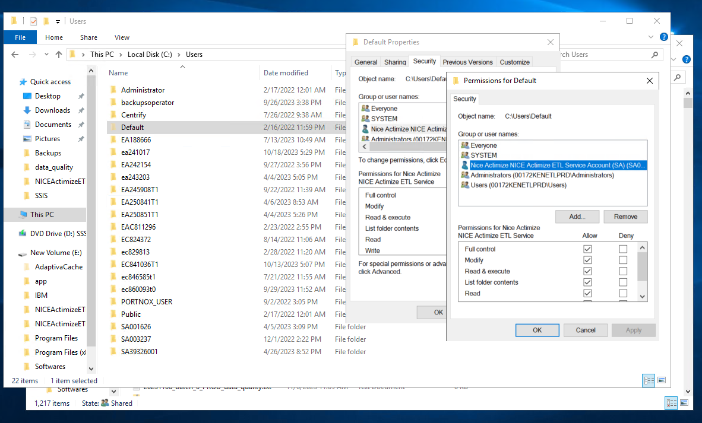

.. _deployment-setup:

===============================
Production Setup and Deployment
===============================

This guide summarizes, at high level, the architecture of the ETL process and by extension the components, resources and assets that work together to ensure the ETL process functions seamlessly. 

.. note::

    * The ETL is a key component to ensure that TAC has access to the data it requires and in the expected format
    * This document will not describe the other components of the TAC system
    * This document will not describe the system architecture as that is provided by TAC application

***************
Sources of Data
***************

Data is extracted from the following sources:

* **Oracle Entreprise Data Warehouse (EDW)** - Is the primary source of data for customer, accounts, transactions etc. The data warehouse contains data for the following source systems:

   * **T24** - The core banking system
   * **TRANZWare** - Contains credit card data
   * **SOPRA** - Contains mobile digital loans data

*****************
ETL Process Steps
*****************

The ETL process includes the following stages, that must be performed in a sequential manner

* Step 1. Extraction of data from sources and loading of raw data onto **EDW_Staging** SQL Server database
* Step 2. Transform the raw data in **EDW_Staging** and load it into **InterfaceDB** SQL Server database
* Step 3. Load the transformed data stored in **CWorks** database 

********************
ETL Deployment Model
********************

The ETL process is mainly handled by SSIS scripts and .bat files. The deployment model will comprise deployment of 3 major components. They are:
   
   #. SSIS scripts
   #. Batch scripts 
 

1. Deploy SSIS Scripts
======================

* Deploy SSIS scripts onto an instance of SQL Server. This allows the SSIS scripts to be executed in 3 ways, viz, manually run directly, run via a SQL job or run using `dtexec utility <https://learn.microsoft.com/en-us/sql/integration-services/packages/dtexec-utility?view=sql-server-ver16>`_. See :ref:`Schedule Package <schedule-package>`:
* An SQL Agent job should be defined:

   #. **TAC ETL Job** 

      This job should run **EndToEndETL.dtsx** and should be scheduled to run at 7am every day. This job handles extraction, loading and transformation of data from source systems. The package also runs the Start Of Day (SOD) routine. The SOD routine is responsible for account segmentation and other related activities.
 

.. note::
   #. ETL generates Excel summaries with the exceptions. The exception file has many worksheets with each worksheet representing a dataset object. Some exceptions related to an entity may be big. 
   #. Some large worksheets, e.g those with 15000 records and above may not load in the final workbook. 
   #. This is because SSIS package works fine in BIDS for loading excel file with more than 15000 rows but failed when same package runs in SQL server Agent Job under proxy account.
   #. The main cause of this is that for large file SSIS process use **C:\\Users\\Default** location to buffer data. So Proxy account needs write access on this folder location. Package works fine in JOB too after this.

2. Deploy batch scripts
=======================

* Copy the .bat files onto a directory located in the SQL server host. This is the server specified in the above step. Take note of the directory path because you will need to update it as part of the SSIS execution parameters. See :ref:`execute-package` for details on how to modify SSIS script parameters. The preferred way is to copy the entire project folder
