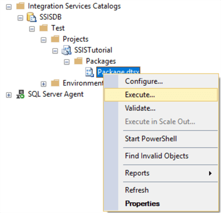
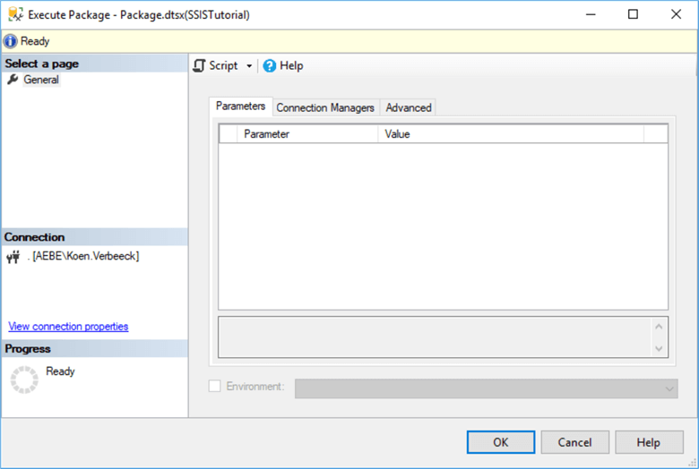
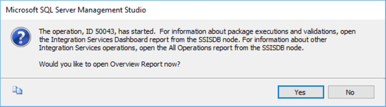
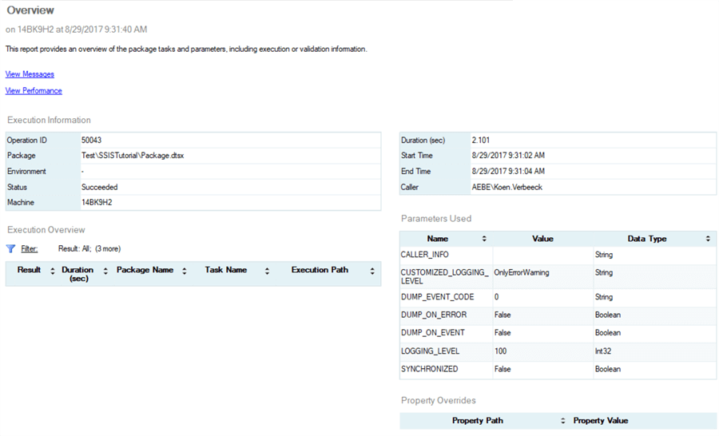

.. _execute-package:

====================
Execute SSIS Package
====================

To execute the package, simply locate it in the catalog folder, right-click it and hit ***Execute***

You will be taken to a dialog where you can edit certain properties, such as the connection managers, parameters if any, the amount of logging and so on. 

Click on OK to start the execution of the package. A pop-up will open asking you if you want to open one of the catalogs built-in reports. 

Click Yes. This will take you to the Overview report, where can see the package has successfully executed. 

To learn more about the catalog reports, check out the tip `Reporting with the SQL Server Integration Services Catalog <https://www.mssqltips.com/sqlservertip/4812/reporting-with-the-sql-server-integration-services-catalog/>`_