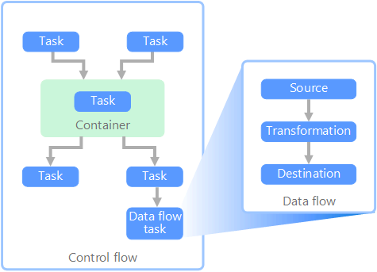

===================
Introduction To ETL
===================

Extract, transform, load (ETL) process
--------------------------------------

Extract, transform, load (ETL) is a data integration process that consolidates data from diverse sources into a unified data store. During the transformation phase, data is modified according to business rules using a specialized engine. This often involves staging tables that temporarily hold data as it is processed and ultimately loaded into its destination.
   

.. image:: _static/images/etl.png
	:width: 600
	:alt: ETL Overview

The data transformation that takes place usually involves various operations, such as filtering, sorting, aggregating, joining data, cleaning data, deduplicating, and validating data.

Data flow and control flow
==========================

In the context of data pipelines, the control flow ensures the orderly processing of a set of tasks. To enforce the correct processing order of these tasks, precedence constraints are used. You can think of these constraints as connectors in a workflow diagram, as shown in the image below. Each task has an outcome, such as success, failure, or completion. Any subsequent task doesn't initiate processing until its predecessor has completed with one of these outcomes.

Control flows execute data flows as a task. In a data flow task, data is extracted from a source, transformed, or loaded into a data store. The output of one data flow task can be the input to the next data flow task, and data flows can run in parallel. Unlike control flows, you can't add constraints between tasks in a data flow. You can, however, add a data viewer to observe the data as it is processed by each task.

In the diagram, there are several tasks within the control flow, one of which is a data flow task. One of the tasks is nested within a container. Containers can be used to provide structure to tasks, providing a unit of work. One such example is for repeating elements within a collection, such as files in a folder or database statements
