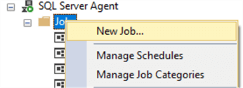
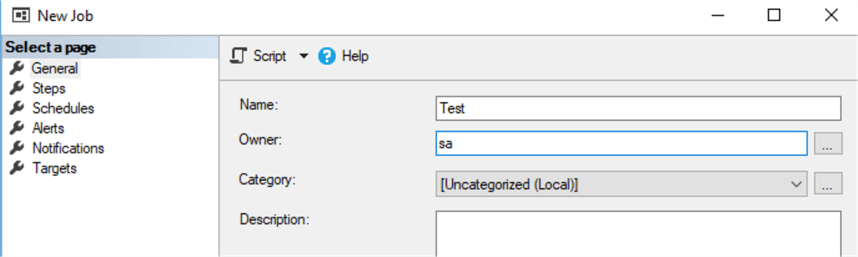
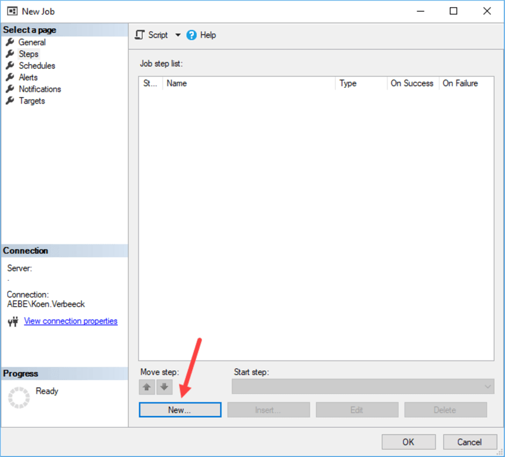
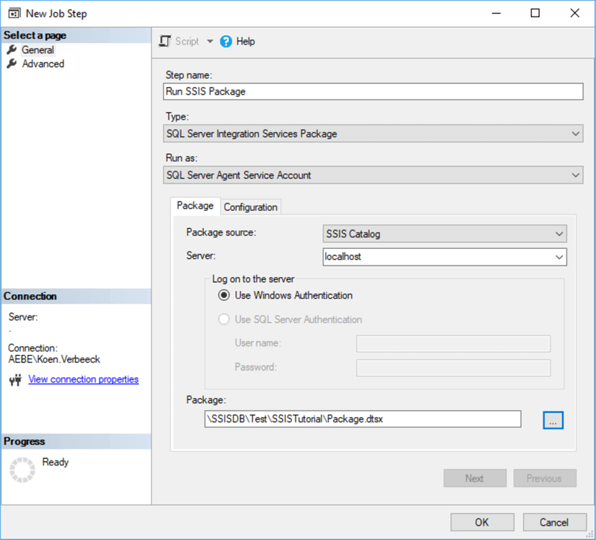

.. _schedule-package:

=====================
Schedule SSIS Package
=====================

Manually executing packages is one thing, but normally you will schedule packages so your ETL can run in a specific time windows (probably at night). The easiest option is SQL Server Agent. You can right-click on the Jobs node to create a new job:

In the General pane, enter a name for the job, choose an owner and optionally enter a description:

In the Steps pane, you can create a new job step. 

 
In the job step configuration, you can enter a name for the step. Choose the SQL Server Integration Services Package type, enter the name of the server and select the package. 

In the configuration tab, you can optionally set more properties, just like when executing a package manually. Click OK to save the job step. In the Schedules tab, you can define one or more schedule to execute the package on predefined points in time. Click New… to create a new schedule. In the schedule editor, you can choose between multiple types of schedules: daily, weekly or monthly. You can also schedule packages to run only once. In the example below we have scheduled the job to run every day at 1AM, except in the weekend. 

Click OK twice to exit the editors. The job is now created and scheduled.

Important Notes
===============

.. note::

	* SSIS package parameters can be modified after deployment but before execution. See :ref:`Package Parameters <package-parameters>`:	
	* You can inspect the logs generated. Robust logging is built in with several reports. See `Reporting with the SQL Server Integration Services Catalog <https://www.mssqltips.com/sqlservertip/4812/reporting-with-the-sql-server-integration-services-catalog/>`_
	
